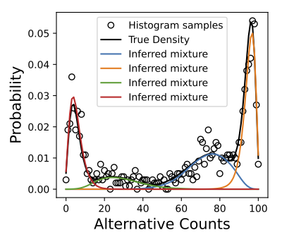

[](https://github.com/PejLab/blnm/actions/workflows/unittest.yml)

# Binomial-Logit-Normal Mixture Model


## Example

Here we provide a simple example for generating data from 
a mixture of bln distributions using `blnm.dist`, and inferring 
the sampling parameters using `blnm.fit`.  A script of this 
example is located in `example/simulate_and_fit.py`.  We begin by 
importing packages:

```python
import numpy as np

import matplotlib.pyplot as plt

from blnm import dist
from blnm import fit
```

then setting simulation parameters

```python
COEFS = [0.2, 0.1, 0.3, 0.4]
MEANS = [-3, -1, 1, 3]
VARIANCE = 0.25
N_COUNTS = 100
N_SAMPLES = 2500
N_REPS = 10
```

Next we generate simulation data using the set parameters and the
`dist.sample_blnm` function. 

```python
alt_allele_counts = dist.sample_blnm(COEFS, MEANS, VARIANCE,
                        N_COUNTS, N_SAMPLES)
n_counts = np.array([N_COUNTS for _ in range(N_SAMPLES)])
```
Note, that each sample is defined by the pair (alt counts, n counts).

To fit the bln mixture model we initialize the the algorithm 
by selecting parameters at random.  In what follows, we fit the blnm
model to the data 10 times, choosig the parameters that result
in the highest log likelihood of the data. 
This is useful because the EM algorithm, in general, 
will converge to a local optimum.  By randomly initializing 
the algorithm at different locations in parameters space we are, in effect, 
asking the algorithm to find a set local optima.  Our hope
is that one of these discovered optima is the global optimum, but
we can make no guarantees.

```python
tmp_pars = fit.blnm(alt_allele_counts, n_counts, len(MEANS), disp=False)
best_pars = tmp_pars

print("Iter\tLog Like\tConverge Iters")
for i in range(1, N_REPS):
    print(i, tmp_pars["log_likelihood"], tmp_pars["iterations"], sep="\t")

    tmp_pars = fit.blnm(alt_allele_counts, 
            n_counts, len(MEANS), disp=False)

    if tmp_pars["log_likelihood"] > best_pars["log_likelihood"]:
        best_pars = tmp_pars

print("Best log-likelihood", best_pars["log_likelihood"])
```

Next we focus our attention to plotting the results.  First,
we generate the true probability mass function and the
empirical mass.

```python
x, empirical_prob = hist(alt_allele_counts)

true_prob = dist.mixture_pmf(x,
                        args.n_counts,
                        COEFS,
                        MEANS,
                        VARIANCE)
```

Then we use matplotlib to fit.

```python
FIGSIZE = (4, 3.5)
FONTSIZE = 15
AX_POSITION = (0.2, 0.2, 0.75, 0.75)


fig, ax = plt.subplots(1,1,figsize=FIGSIZE)
ax.plot(x, empirical_prob, "o", 
        mfc="none", 
        color="k", 
        label="Histogram samples")
ax.plot(x, true_prob, "-", color="k", label="True Density")

for coef_i, mean_i in zip(best_pars["coefs"], best_pars["means"]):

    prob = coef_i * dist.pmf(x, args.n_counts,
                           mean_i,
                           best_pars["variance"])
    ax.plot(x, prob, "-", label="Inferred mixture")

ax.legend(loc=0)
ax.set_position(AX_POSITION)

ax.set_xlabel("Alternative Counts", fontsize=FONTSIZE)
ax.set_ylabel("Probability", fontsize=FONTSIZE)

fig.savefig("pmf.png")
```



